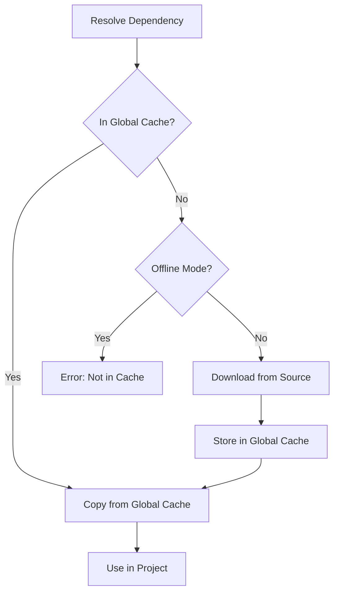

# Caching

Porters provides a powerful caching system to speed up dependency resolution and avoid redundant downloads. The caching system operates at two levels: **global cache** and **local cache**.

## 📦 Global Cache

The global cache is a centralized cache stored in `~/.porters/cache/` that is shared across all Porters projects on your system. This means that once a dependency is downloaded for any project, it can be reused by all other projects without re-downloading.

### Benefits

- **Faster builds**: Dependencies are downloaded only once
- **Reduced bandwidth**: No redundant downloads
- **Offline support**: Work without internet using cached dependencies
- **Disk space efficiency**: Shared storage across projects

### Cache Location

| Platform | Cache Directory |
|----------|----------------|
| **Linux/macOS** | `~/.porters/cache/` |
| **Windows** | `C:\Users\<YourName>\.porters\cache\` |

### Cache Structure

```
~/.porters/cache/
├── package_name/
│   ├── 1.0.0/
│   │   ├── include/
│   │   ├── src/
│   │   └── .checksum
│   ├── 1.1.0/
│   │   ├── include/
│   │   ├── src/
│   │   └── .checksum
│   └── 2.0.0/
│       ├── include/
│       ├── src/
│       └── .checksum
└── another_package/
    └── 3.0.0/
        ├── lib/
        └── .checksum
```

Each package version is stored in its own directory with a checksum file for integrity verification.

## 🗂️ Local Cache

The local cache is project-specific and stored in `.porters/cache/` within your project directory. It contains:

- Downloaded dependency source code
- Build artifacts
- Temporary files from dependency resolution

### Local Cache Structure

```
.porters/
└── cache/
    ├── sources/           # Git clones and downloaded sources
    │   ├── lib_a-abc123/
    │   └── lib_b-def456/
    └── artifacts/         # Compiled binaries and libraries
        ├── lib_a.a
        └── lib_b.so
```

## 🔄 Cache Workflow

When resolving dependencies, Porters follows this workflow:

1. **Check Global Cache**: First, check if the dependency exists in `~/.porters/cache/`
2. **Use Cached Version**: If found, copy from global cache to project (fast)
3. **Download**: If not cached, download the dependency from source
4. **Store in Global Cache**: After download, store in global cache for future use
5. **Local Project Use**: Make dependency available to the current project



## 🎯 Using the Cache

### Automatic Caching

Caching is automatic and requires no configuration. When you add a dependency:

```bash
porters add https://github.com/user/library
```

Porters automatically:
1. Checks global cache for existing version
2. Downloads if not cached
3. Stores in global cache
4. Makes available to your project

### Check Cache Statistics

View cache usage and statistics:

```bash
porters cache stats
```

**Example Output**:
```
📊 Global Cache Statistics
Location: /home/user/.porters/cache/
Packages: 15
Total Size: 245.3 MB

Recent Packages:
  ✓ fmt @ 10.1.1 (cached 2 days ago)
  ✓ spdlog @ 1.12.0 (cached 1 week ago)
  ✓ nlohmann_json @ 3.11.2 (cached 3 days ago)
```

### List Cached Packages

See all packages in the global cache:

```bash
porters cache list
```

**Example Output**:
```
📦 Globally Cached Packages (15)

  fmt
    ├── 9.1.0
    ├── 10.0.0
    └── 10.1.1
  
  spdlog
    ├── 1.11.0
    └── 1.12.0
  
  nlohmann_json
    └── 3.11.2
```

### Clear Cache

Remove all cached packages to free disk space:

```bash
# Clear global cache
porters cache clear

# Clear only local project cache
porters cache clear --local
```

**Warning**: This will remove all cached dependencies. They will need to be re-downloaded when next used.

### Clear Specific Package

Remove a specific package from cache:

```bash
porters cache remove <package_name>

# Remove specific version
porters cache remove <package_name> --version 1.0.0
```

## ⚙️ Cache Configuration

Configure caching behavior in `~/.porters/config.toml`:

```toml
[cache]
enabled = true           # Enable/disable global cache
max_size_mb = 2048      # Maximum cache size (MB)
auto_clean = true        # Automatically clean old packages
cache_dir = "~/.porters/cache"  # Custom cache directory (optional)

# Auto-clean settings
[cache.clean]
max_age_days = 90       # Remove packages not used in 90 days
min_free_space_mb = 500 # Keep at least 500MB free
```

### Disable Caching

To disable global caching:

```toml
[cache]
enabled = false
```

With caching disabled, dependencies are downloaded directly to each project without global storage.

### Custom Cache Directory

Use a custom cache directory (e.g., on a different drive):

```toml
[cache]
cache_dir = "/mnt/data/porters_cache"  # Linux/macOS
# cache_dir = "D:\\PortersCache"       # Windows
```

## 🔒 Offline Mode

Work entirely offline using only cached dependencies. See [Configuration](./configuration.md#offline-mode) for details.

When offline mode is enabled:
- No network requests are made
- Only cached dependencies can be used
- Attempting to download uncached dependencies fails with clear error

**Enable offline mode**:

```toml
# In ~/.porters/config.toml
offline = true

# Or in project porters.toml
[project]
offline = true
```

**Use offline mode temporarily**:

```bash
porters build --offline
porters add <dep> --offline
```

## 🛡️ Cache Integrity

Porters ensures cache integrity through:

### Checksums

Every cached package has a SHA-256 checksum:
- Calculated when package is first cached
- Verified when retrieving from cache
- Detects corrupted or modified cache entries

### Automatic Cleanup

With `auto_clean = true`, Porters automatically:
- Removes corrupted packages
- Deletes incomplete downloads
- Cleans up old versions to free space
- Maintains cache health

### Manual Verification

Verify cache integrity:

```bash
porters cache verify
```

This checks:
- All checksums match stored values
- Directory structures are intact
- No corrupted files exist

## 📊 Cache Performance

### Space Savings

Typical space savings with global cache:

| Projects | Without Cache | With Cache | Savings |
|----------|--------------|------------|---------|
| 5 projects | 500 MB | 150 MB | 70% |
| 10 projects | 1.2 GB | 200 MB | 83% |
| 20 projects | 2.5 GB | 300 MB | 88% |

### Time Savings

Typical time savings:

| Dependency Size | Download | From Cache | Speedup |
|----------------|----------|------------|---------|
| Small (< 1 MB) | 2-5 sec | < 1 sec | 3-5x |
| Medium (1-10 MB) | 10-30 sec | 1-2 sec | 10-15x |
| Large (> 10 MB) | 60+ sec | 3-5 sec | 12-20x |

## 🔍 Troubleshooting

### Cache Permission Errors

If you encounter permission errors:

```bash
# Linux/macOS
chmod -R 755 ~/.porters/cache

# Or change owner
sudo chown -R $USER:$USER ~/.porters/cache
```

### Corrupted Cache

If cache is corrupted:

```bash
# Clear and rebuild cache
porters cache clear
porters install  # Reinstall dependencies
```

### Disk Space Issues

If running out of disk space:

```bash
# Check cache size
porters cache stats

# Remove old packages
porters cache clean --max-age-days 30

# Or clear entirely
porters cache clear
```

### Cache Not Working

Verify cache is enabled:

```bash
# Check configuration
cat ~/.porters/config.toml | grep -A3 "\[cache\]"

# Expected output:
# [cache]
# enabled = true
# max_size_mb = 1024
# auto_clean = true
```

## 🎓 Best Practices

### 1. Regular Maintenance

```bash
# Monthly cache cleanup
porters cache clean --max-age-days 60

# Check cache health
porters cache verify
```

### 2. Optimize Cache Size

```toml
[cache]
max_size_mb = 1024  # Adjust based on available disk space
auto_clean = true   # Enable automatic cleanup
```

### 3. Use Offline Mode for CI/CD

```yaml
# .github/workflows/build.yml
- name: Build with cache
  run: |
    porters cache list
    porters build --offline  # Use only cached deps
```

### 4. Share Cache in Teams

For team development, consider:
- Shared network cache directory
- Pre-populated cache in Docker images
- Cache backup/restore scripts

### 5. Monitor Cache Growth

```bash
# Weekly check
porters cache stats

# Set up alerts if cache > 2GB
du -sh ~/.porters/cache
```

## 📚 See Also

- [Configuration](./configuration.md) - Global and project configuration
- [Offline Mode](./configuration.md#offline-mode) - Working without internet
- [Dependency Management](./dependencies.md) - Managing dependencies
- [Registry](./registry.md) - Package registry system
